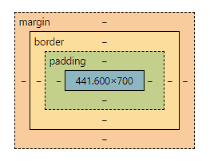

## 盒子模型

盒子模型主要由以下四个部分组成：

- 内容（Content）: 它是盒子模型的中心部分，包含了实际的内容，比如文本、图片等。
- 内边距（Padding）: 内边距位于内容区域的外围。
- 边框（Border）: 边框环绕在内边距的外侧。
- 外边距（Margin）: 外边距是盒子模型的最外层，可以控制元素之间的间隔。

  

- 盒子的宽度（Width）：盒子的宽度由内容宽度、内边距和边框宽度的总和决定。
- 盒子的高度（Height）：盒子的高度由内容高度、内边距和边框高度的总和决定。

1. **width**：设置盒子的宽度。

   ```css
   .box {
     width: 300px;
   }
   ```

2. **height**：设置盒子的高度。

   ```css
   .box {
     height: 200px;
   }
   ```

3. **padding**：设置盒子的内边距，控制内容与边框之间的空白区域。可以使用`padding-top`、`padding-right`、`padding-bottom`和`padding-left`来分别指定上、右、下和左的内边距。

   ```css
   .box {
     padding: 20px;
   }
   ```

4. **border**：设置盒子的边框样式、宽度和颜色。可以使用`border-width`、`border-style`和`border-color`分别指定边框的宽度、样式和颜色。也可以使用`border-top`、`border-right`、`border-bottom`和`border-left`来分别指定上、右、下和左的边框。

   ```css
   .box {
     border: 1px solid #000;
   }
   ```

5. **margin**：设置盒子的外边距，控制元素与其他元素之间的间隔。可以使用`margin-top`、`margin-right`、`margin-bottom`和`margin-left`来分别指定上、右、下和左的外边距。

   ```css
   .box {
     margin: 10px;
   }
   ```

6. **box-sizing**：指定盒子模型的类型，可以是`content-box`（标准盒子模型）或`border-box`（IE 盒子模型）。
   盒子模型（Box Model）是 CSS 中用来描述和布局 HTML 元素的概念。它将每个 HTML 元素看作一个矩形的盒子，由内容区域、内边距、边框和外边距组成。

   在 CSS 中，盒子模型有两种常见的类型：

   - 标准盒子模型（Content Box Model）：
     标准盒子模型是 CSS 的默认盒子模型。在标准盒子模型中，一个元素的宽度和高度仅包括其内容区域（content area），不包括内边距、边框和外边距。

   ```
   +---------------------------+
   |       content area        |
   |                           |
   +---------------------------+
   ```

   在标准盒子模型中，元素的总宽度 = 左内边距 + 左边框 + 内容宽度 + 右边框 + 右内边距，元素的总高度 = 上内边距 + 上边框 + 内容高度 + 下边框 + 下内边距。

   - IE 盒子模型（Border Box Model）：
     IE 盒子模型是早期 Internet Explorer 浏览器使用的盒子模型。在 IE 盒子模型中，一个元素的宽度和高度包括其内容区域、内边距和边框，不计算外边距。

   ```css
   .box {
     box-sizing: border-box;
   }
   ```

7. **display**：指定元素的显示方式，常用的值包括`block`（块级元素）、`inline`（内联元素）和`inline-block`（内联块级元素）。

   ```css
   .box {
     display: inline-block;
   }
   ```

8. **float**：指定元素的浮动方式，使元素脱离正常的文档流，常用于实现多列布局。

   Float（浮动）：

   - float 属性用于将元素从正常的文档流中浮动到其容器的左侧或右侧，以便实现元素的排列。
   - 值可以是`left`（左浮动）、`right`（右浮动）或`none`（默认值，不浮动）。
   - 浮动的元素会脱离正常的文档流，其他元素会围绕浮动元素进行布局。
   - 使用浮动通常可以实现多列布局、图文混排等效果。

   ```css
   .box {
     float: left;
   }
   ```

9. **position**：指定元素的定位方式，常用的值包括`relative`（相对定位）、`absolute`（绝对定位）和`fixed`（固定定位）。
   [https://developer.mozilla.org/en-US/docs/Web/CSS/position#try_it](https://developer.mozilla.org/en-US/docs/Web/CSS/position#try_it)

   - position 属性用于控制元素的定位方式，指定元素在页面中的位置。
   - 值可以是`static`（默认值，元素在正常的文档流中）、`relative`（相对定位）、`absolute`（绝对定位）、`fixed`（固定定位）或`sticky`（粘性定位）。
   - 相对定位（relative）：元素相对于其正常位置进行定位，可以使用`top`、`right`、`bottom`和`left`属性来指定偏移量。
   - 绝对定位（absolute）：元素相对于最近的已定位祖先元素进行定位，如果不存在已定位的祖先元素，则相对于文档的初始包含块进行定位。
   - 固定定位（fixed）：元素相对于浏览器窗口进行定位，即元素会固定在页面的某个位置不动。
   - 粘性定位（sticky）：元素在滚动到特定位置时变为固定定位，否则保持相对定位的状态

   ```css
   .box {
     position: absolute;
     top: 50%;
     left: 50%;
     transform: translate(-50%, -50%);
   }
   ```

10. **overflow**：控制当内容超出盒子尺寸时的显示方式。常用的值包括`visible`（默认，内容超出盒子会显示在盒子外部）、`hidden`（内容超出盒子会被隐藏）、`scroll`（显示滚动条，无论内容是否超出盒子）和`auto`（根据内容是否超出盒子自动显示滚动条）。
    ```css
    .box {
      overflow: auto;
    }
    ```
