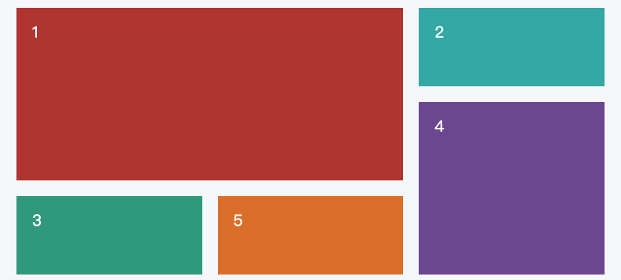

## 常见

### 弹性盒子（Flexbox）

弹性盒子（Flexbox）用于创建灵活且响应式的布局。它通过指定容器和其内部元素的属性来实现灵活的布局。

参考：[Flex 布局教程：语法篇](https://www.ruanyifeng.com/blog/2015/07/flex-grammar.html)


要使用弹性盒子布局，需要设置一个容器元素的`display`属性为`flex`或`inline-flex`。容器元素的子元素将成为弹性盒子的项目。

以下是弹性盒子中常用的属性和其作用：

1. `flex-direction`：指定弹性盒子的主轴方向。默认值是`row`，表示从左到右排列。其他值包括`column`（从上到下排列）、`row-reverse`（从右到左排列）和`column-reverse`（从下到上排列）。

2. `justify-content`：控制项目在主轴上的对齐方式。可以使用不同的值，如`flex-start`（默认值，左对齐）、`flex-end`（右对齐）、`center`（居中对齐）、`space-between`（两端对齐，项目之间平均分布）和`space-around`（项目两侧留有间隔，项目之间平均分布）。

3. `align-items`：控制项目在交叉轴上的对齐方式。可以使用不同的值，如`flex-start`（顶部对齐）、`flex-end`（底部对齐）、`center`（居中对齐）、`baseline`（基线对齐）和`stretch`（拉伸填充）。

4. `flex-wrap`：控制项目是否换行。默认值是`nowrap`，表示不换行。其他值包括`wrap`（换行）和`wrap-reverse`（反向换行）。

5. `align-content`：控制多行弹性盒子在交叉轴上的对齐方式。适用于多行弹性盒子，当有多行时，可以使用不同值来控制对齐方式。

6. `flex-grow`：指定项目的放大比例。默认值为 0，表示不放大。如果所有项目的`flex-grow`都为 1，则它们将平均分配剩余空间。如果一个项目的`flex-grow`为 2，其他项目为 1，则前者将获得更多的剩余空间。

7. `flex-shrink`：指定项目的缩小比例。默认值为 1，表示当空间不足时，项目将等比例缩小。如果一个项目的`flex-shrink`为 0，其他项目为 1，则前者不会缩小。

8. `flex-basis`：指定项目在主轴上的初始大小。默认值为`auto`，表示由内容决定大小。可以设置为具体的长度值或百分比。

### Grid



网格布局（Grid）将网页划分成一个个网格，可以任意组合不同的网格，做出各种各样的布局。

参考：[CSS Grid 网格布局教程](https://www.ruanyifeng.com/blog/2019/03/grid-layout-tutorial.html)，作者： 阮一峰

1. grid-template-columns：用于定义网格的列的大小和布局。您可以指定具体的长度值或使用关键字来定义列的大小。例如：

```css
.grid-container {
  display: grid;
  grid-template-columns: 100px 200px 1fr;
}
```

上述示例中，网格容器有三个列，第一列的宽度为 100px，第二列的宽度为 200px，第三列的宽度为剩余空间的 1 份（fr 表示分数）。

2. grid-template-rows：用于定义网格的行的大小和布局。与 grid-template-columns 类似，您可以指定具体的长度值或使用关键字来定义行的大小。例如：

```css
.grid-container {
  display: grid;
  grid-template-rows: 50px auto 1fr;
}
```

上述示例中，网格容器有三行，第一行的高度为 50px，第二行的高度为内容的高度，第三行的高度为剩余空间的 1 份。

3. repeat()：该函数可以用于重复一个模式。它接受两个参数，第一个参数是重复的次数，第二个参数是要重复的模式。例如：

```css
.grid-container {
  display: grid;
  grid-template-columns: repeat(3, 100px);
}
```

上述示例中，网格容器有三个列，每个列的宽度都为 100px。

4. auto-fill 关键字：当使用 repeat()函数时，可以结合 auto-fill 关键字来自动填充网格。它会根据可用空间自动计算重复的次数。例如：

```css
.grid-container {
  display: grid;
  grid-template-columns: repeat(auto-fill, minmax(100px, 1fr));
}
```

上述示例中，网格容器中的列会自动填充，每个列的宽度为 100px，但如果可用空间不足，则自动调整为 1 份。

5. fr 关键字：用于定义分数单位，表示剩余空间的一部分。例如：

```css
.grid-container {
  display: grid;
  grid-template-columns: 1fr 2fr;
}
```

上述示例中，网格容器有两个列，第一列的宽度为剩余空间的 1 份，第二列的宽度为剩余空间的 2 份。

6. minmax()：该函数用于定义一个范围，指定最小值和最大值之间的大小。它在定义网格的列或行的大小时非常有用。例如：

```css
.grid-container {
  display: grid;
  grid-template-columns: minmax(100px, 1fr) 200px;
}
```

上述示例中，网格容器有两个列，第一列的宽度为 100px 到剩余空间的 1 份之间，第二列的宽度为 200px。

7. grid-column-gap：用于指定网格列之间的间距。例如：

```css
.grid-container {
  display: grid;
  grid-template-columns: 100px 200px;
  grid-column-gap: 20px;
}
```

上述示例中，网格容器的列之间有 20px 的间距。

8. grid-row-gap：用于指定网格行之间的间距。例如：

```css
.grid-container {
  display: grid;
  grid-template-rows: 50px auto;
  grid-row-gap: 10px;
}
```

上述示例中，网格容器的行之间有 10px 的间距。

9. grid-gap：用于同时指定网格列和行之间的间距。例如：

```css
.grid-container {
  display: grid;
  grid-template-columns: 100px 200px;
  grid-template-rows: 50px auto;
  grid-gap: 10px 20px;
}
```

上述示例中，网格容器的列之间有 20px 的间距，行之间有 10px 的间距。

10. grid-column：用于指定一个项目跨越的列数。例如：

```css
.grid-item {
  grid-column: span 2;
}
```

上述示例中，一个网格项目跨越两列。

11. grid-row：用于指定一个项目跨越的行数。例如：

```css
.grid-item {
  grid-row: span 3;
}
```

上述示例中，一个网格项目跨越三行。

### 2D/3D 转换

CSS3 允许我们通过 transform 属性，对 HTML 元素进行旋转、缩放、平移等变换操作，从而实现更加生动、立体的界面效果。 transform-origin 转换元素的位置（围绕那个点进行转换），默认的转换原点是 center

```css
transform: rotate(30deg);
transform: translate(120px, 50%); // 位移
transform: scale(2, 0.5); // 缩放
transform: rotate(0.5turn); // 旋转
transform: skew(30deg, 20deg); // 倾斜
```

### 边框圆角

CSS3 允许我们通过 border-radius 属性，为 HTML 元素的边框设置圆角效果。

```css
border-radius: 5px;
```

## 媒体查询

媒体查询（Media Queries）是 CSS3 中的一个特性，它允许开发者根据设备的特性和屏幕尺寸来应用不同的样式和布局。

通过媒体查询，可以根据设备的属性（如屏幕宽度、高度、方向、分辨率等）来应用不同的 CSS 规则。这样，可以根据设备的特性来为不同的屏幕大小和设备类型提供最佳的用户体验。

媒体查询通常使用@media 规则来定义。例如，以下是一个简单的媒体查询示例，应用于当浏览器窗口宽度小于等于 600 像素时：

```css
@media (max-width: 600px) {
  /* 在窗口宽度小于等于600px时应用的样式 */
  body {
    background-color: lightblue;
  }
}
```

在上面的示例中，当浏览器窗口宽度小于等于 600 像素时，body 元素的背景颜色将变为浅蓝色。

媒体查询还可以使用逻辑运算符（如 and、or 和 not）来组合多个条件。例如：

```css
@media (max-width: 600px) and (orientation: landscape) {
  /* 在窗口宽度小于等于600px且为横向模式时应用的样式 */
  body {
    font-size: 16px;
  }
}
```

在上面的示例中，当浏览器窗口宽度小于等于 600 像素且为横向模式时，body 元素的字体大小将变为 16 像素。

使用媒体查询，可以根据不同的设备特性和屏幕尺寸提供不同的样式和布局，从而实现响应式设计和优化用户体验。
