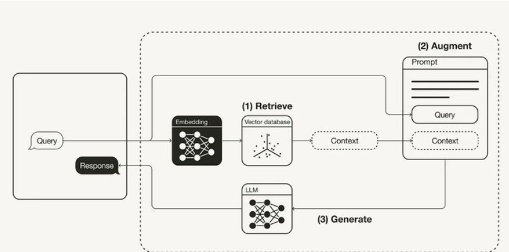

## 概述

检索增强生成 (Retrieval-Augmented Generation, RAG) 是一种结合了信息检索和生成式模型的技术，在生成自然语言文本时利用了外部知识库或文档的相关信息。这种方法特别适用于需要准确、上下文相关信息的任务，例如问答系统、对话生成等。

## 架构

RAG 的架构通常包括以下几个关键组件：

1. **检索器 (Retriever)**: 负责从庞大的文档库中提取与输入查询相关的文档片段。常用的检索技术包括 TF-IDF、BM25，以及基于深度学习的向量检索方法（如 Dense Passage Retrieval, DPR）。
2. **生成器 (Generator)**: 生成器是一个生成式语言模型（如 GPT-3、T5），它根据检索到的文档内容和输入查询生成最终的输出文本。

3. **融合机制 (Fusion Mechanism)**: 将检索到的文档内容与输入查询融合，提供生成器所需的上下文。融合机制可以是简单的拼接，也可以是更复杂的注意力机制。

RAG（Retrieval-Augmented Generation）是一种结合检索和生成的自然语言处理方法，主要用于提升生成式模型的性能。

## RAG 的基本流程

1. **检索（Retrieval）**：

   - 从大型文档库中检索与输入问题相关的文档或段落。
   - 使用向量检索技术，如基于 BERT 或 DPR（Dense Passage Retrieval）的方法，将输入和文档向量化，并通过相似度计算找到最相关的文本。

2. **生成（Generation）**：
   - 将检索到的文档与输入问题一起输入到生成模型（如 BART 或 T5），生成最终的答案。
   - 生成模型利用检索到的上下文，增强回答的准确性和相关性。

### 优化各个流程的方法：

1. **检索优化**：

   - **索引增强**：使用更高效的索引结构（如 HNSW）来加速检索。
   - **模型调整**：通过微调 DPR 等模型来提高检索的准确性。
   - **多模态检索**：结合文本、图像或其他数据形式进行检索，以获取更全面的信息。

2. **生成优化**：

   - **模型微调**：使用领域特定数据集对生成模型进行微调，以提高生成结果的专业性。
   - **融合策略**：使用多种生成模型（如交叉验证）并融合它们的输出以提高答案质量。
   - **上下文扩展**：在生成过程中，引入更多上下文信息，避免信息缺失。

3. **整体优化**：
   - **反馈循环**：引入用户反馈机制，持续优化检索和生成模型。
   - **混合模型**：结合检索和生成模型的优势，动态调整两者的权重。
   - **计算效率**：优化计算资源的使用，降低延迟，提高响应速度。

## 优势

- **知识丰富**: 通过检索外部文档，RAG 可以利用更广泛的知识库。
- **准确性高**: 结合检索和生成，RAG 可以在生成过程中引用具体的文档，提高内容的准确性。
- **动态更新**: 只需更新文档库即可让系统获取最新的知识，无需重新训练生成模型。

## 应用场景

- **智能问答系统**: 利用外部知识库提供准确的答案。
- **对话生成**: 在对话中引入外部信息，提供更丰富的对话内容。
- **文档摘要**: 从长文档中提取关键信息生成摘要。
