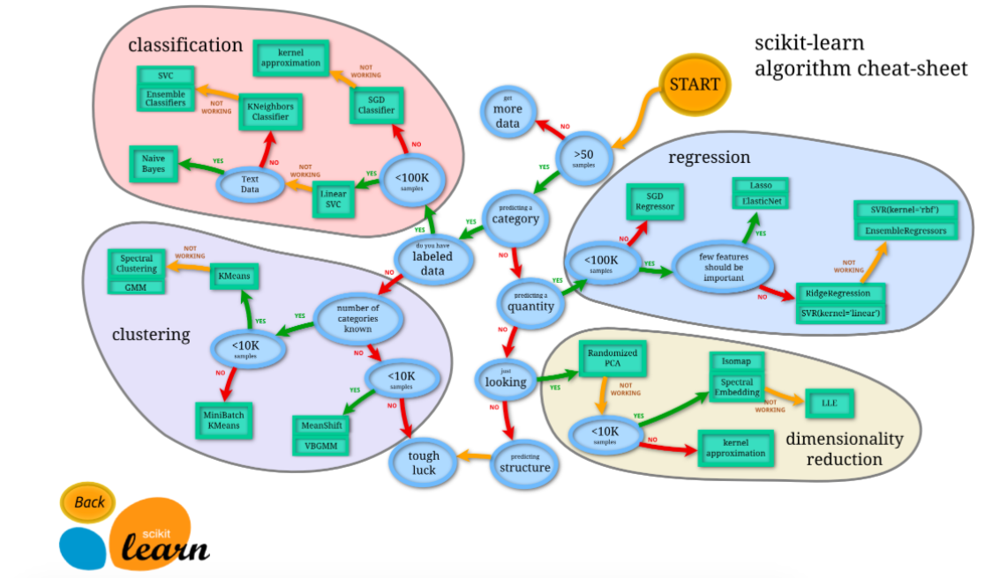

以下是对 `sklearn` 子模块更详细的补充说明，涵盖每个模块的核心功能、关键类和典型应用场景：

### **1. 数据预处理与特征工程**

- **`preprocessing`**

  - **功能**：数据标准化、归一化、编码、离散化、自定义转换。
  - **关键类/函数**：
    - `StandardScaler`（标准化）、`MinMaxScaler`（归一化）
    - `OneHotEncoder`（独热编码）、`LabelEncoder`（标签编码）
    - `PolynomialFeatures`（生成多项式特征）
    - `FunctionTransformer`（自定义函数转换）
  - **场景**：处理数值型数据标准化、分类变量编码、生成非线性特征。

- **`feature_extraction`**

  - **功能**：从文本/图像/字典等非结构化数据中提取特征。
  - **关键类**：
    - **文本**：`CountVectorizer`（词袋模型）、`TfidfVectorizer`（TF-IDF 权重）
    - **图像**：`PatchExtractor`（图像块提取）
    - **字典**：`DictVectorizer`（字典转稀疏矩阵）
  - **场景**：自然语言处理（NLP）、图像局部特征提取。

- **`feature_selection`**

  - **功能**：通过统计方法或模型选择重要特征，降低维度。
  - **关键类**：
    - `VarianceThreshold`（低方差特征过滤）
    - `SelectKBest`（基于统计检验选择 Top-K 特征）
    - `RFE`（递归特征消除，基于模型权重）
  - **场景**：高维数据降维、消除冗余特征。

- **`impute`**

  - **功能**：缺失值填补（均值、中位数、固定值等）。
  - **关键类**：`SimpleImputer`（单变量填补）、`IterativeImputer`（多变量迭代填补）
  - **场景**：处理数据缺失问题。

- **`random_projection`**

  - **功能**：通过随机投影实现高效降维（适用于高维数据）。
  - **关键类**：`GaussianRandomProjection`、`SparseRandomProjection`
  - **场景**：大规模数据降维，近似最近邻搜索。

- **`compose`**
  - **功能**：构建特征处理管道，组合不同预处理步骤。
  - **关键类**：
    - `ColumnTransformer`（按列应用不同预处理器）
    - `TransformedTargetRegressor`（对回归目标变量进行转换）
  - **场景**：结构化数据中混合数值和分类特征的统一处理。

---

### **2. 模型训练与评估**

- **`model_selection`**

  - **功能**：模型选择、超参数调优、验证策略。
  - **关键类**：
    - `GridSearchCV`（网格搜索交叉验证）、`RandomizedSearchCV`（随机搜索）
    - `KFold`（K 折交叉验证）、`train_test_split`（拆分训练集/测试集）
    - `learning_curve`（学习曲线分析）
  - **场景**：自动化调参、评估模型泛化能力。

- **`metrics`**

  - **功能**：提供分类、回归、聚类、排序等评估指标。
  - **关键指标**：
    - **分类**：`accuracy_score`、`roc_auc_score`、`f1_score`
    - **回归**：`mean_squared_error`、`r2_score`
    - **聚类**：`silhouette_score`（轮廓系数）、`adjusted_rand_score`
    - **排序**：`ndcg_score`（归一化折损累计增益）
  - **场景**：量化模型性能，支持多任务评估。

- **`calibration`**

  - **功能**：校准分类模型输出的概率（使其更接近真实概率）。
  - **关键类**：`CalibratedClassifierCV`（基于 sigmoid 或 isotonic 回归校准）
  - **场景**：需要可靠概率估计的任务（如医疗诊断）。

- **`cross_decomposition`**
  - **功能**：交叉分解方法，用于分析两个矩阵的关系。
  - **关键类**：`PLSCanonical`（偏最小二乘）、`CCA`（典型相关分析）
  - **场景**：多变量数据间的关联分析（如基因表达与表型数据）。

---

### **3. 监督学习模型**

- **`linear_model`**

  - **功能**：线性模型（回归/分类）及其正则化变体。
  - **关键类**：
    - `LinearRegression`（普通最小二乘）
    - `LogisticRegression`（逻辑回归，支持 L1/L2 正则化）
    - `Ridge`（岭回归）、`Lasso`（L1 正则化回归）
    - `SGDClassifier`（随机梯度下降分类器）
  - **场景**：线性可分数据、高维稀疏数据（如文本分类）。

- **`svm`**

  - **功能**：支持向量机（SVM）及其核方法。
  - **关键类**：
    - `SVC`（分类）、`SVR`（回归）
    - `LinearSVC`（线性核优化版本）
  - **场景**：小样本高维数据、非线性可分数据（使用 RBF 核）。

- **`neighbors`**

  - **功能**：基于邻居的模型（分类/回归）和最近邻搜索。
  - **关键类**：
    - `KNeighborsClassifier`（KNN 分类）、`KNeighborsRegressor`（KNN 回归）
    - `NearestNeighbors`（无监督最近邻搜索）
  - **场景**：推荐系统（协同过滤）、异常检测。

- **`tree`**

  - **功能**：决策树及其集成方法（随机森林、梯度提升树）。
  - **关键类**：
    - `DecisionTreeClassifier`（分类树）
    - `RandomForestClassifier`（随机森林）、`GradientBoostingClassifier`（梯度提升树）
    - `plot_tree`（可视化决策树）
  - **场景**：可解释性强的模型、非线性和交互特征建模。

- **`naive_bayes`**

  - **功能**：朴素贝叶斯分类器（假设特征条件独立）。
  - **关键类**：
    - `GaussianNB`（高斯分布）、`MultinomialNB`（多项式分布，文本分类常用）
  - **场景**：文本分类（如垃圾邮件检测）。

- **`discriminant_analysis`**

  - **功能**：线性判别分析（LDA）和二次判别分析（QDA）。
  - **关键类**：`LinearDiscriminantAnalysis`、`QuadraticDiscriminantAnalysis`
  - **场景**：分类任务中的降维（LDA 也可用于可视化）。

- **`neural_network`**

  - **功能**：基础神经网络模型。
  - **关键类**：`MLPClassifier`（多层感知机分类）、`MLPRegressor`（多层感知机回归）
  - **场景**：简单非线性问题（复杂网络推荐使用深度学习框架）。

- **`isotonic`**
  - **功能**：保序回归（拟合单调函数）。
  - **关键类**：`IsotonicRegression`
  - **场景**：校准概率输出或单调趋势预测（如药物剂量响应）。

---

### **4. 无监督学习与聚类**

- **`cluster`**

  - **功能**：聚类算法及评估。
  - **关键类**：
    - `KMeans`（K 均值）、`DBSCAN`（基于密度的聚类）
    - `AgglomerativeClustering`（层次聚类）
    - `AffinityPropagation`（吸引力传播）
  - **场景**：客户分群、图像分割、社交网络分析。

- **`mixture`**

  - **功能**：概率模型（如高斯混合模型）。
  - **关键类**：`GaussianMixture`（GMM，软聚类）、`BayesianGaussianMixture`（贝叶斯 GMM）
  - **场景**：生成数据分布模型、密度估计。

- **`decomposition`**

  - **功能**：矩阵分解与降维。
  - **关键类**：
    - `PCA`（主成分分析）、`TruncatedSVD`（截断 SVD，适合稀疏数据）
    - `NMF`（非负矩阵分解，用于图像或文本主题提取）
    - `FastICA`（独立成分分析，盲源分离）
  - **场景**：特征降维、图像压缩、主题建模。

- **`manifold`**
  - **功能**：流形学习（非线性降维）。
  - **关键类**：
    - `TSNE`（t-SNE 可视化）、`UMAP`（保留全局与局部结构）
    - `MDS`（多维缩放）、`Isomap`（等距映射）
  - **场景**：高维数据可视化（如 MNIST 手写数字）。

---

### **5. 集成方法**

- **`ensemble`**
  - **功能**：集成多个基模型的预测结果。
  - **关键类**：
    - `RandomForestClassifier`（随机森林，Bagging 策略）
    - `AdaBoostClassifier`（AdaBoost，Boosting 策略）
    - `VotingClassifier`（投票集成多个模型）
    - `StackingClassifier`（堆叠泛化，需配合其他模型）
  - **场景**：提升模型稳定性与泛化能力（如 Kaggle 竞赛）。

---

### **6. 半监督与特殊场景**

- **`semi_supervised`**

  - **功能**：半监督学习（部分标签缺失）。
  - **关键类**：`LabelPropagation`（标签传播）、`SelfTrainingClassifier`（自训练）
  - **场景**：标注成本高的任务（如医学图像标注）。

- **`multiclass`**

  - **功能**：将二分类模型扩展为多分类。
  - **关键类**：`OneVsRestClassifier`（一对其余策略）、`OneVsOneClassifier`（一对一策略）
  - **场景**：支持 SVM 等原生二分类模型处理多类问题。

- **`multioutput`**
  - **功能**：处理多输出回归/分类（如同时预测多个目标变量）。
  - **关键类**：`MultiOutputRegressor`、`ClassifierChain`（链式分类）
  - **场景**：多标签分类（如电影类型预测）、多目标回归。

---

### **7. 工具与辅助功能**

- **`pipeline`**

  - **功能**：将多个处理步骤封装为单个可训练对象。
  - **关键类**：`Pipeline`（顺序执行步骤）、`FeatureUnion`（并行合并特征）
  - **场景**：自动化机器学习流程（如预处理+模型+后处理）。

- **`datasets`**

  - **功能**：提供内置数据集和生成模拟数据。
  - **关键函数**：
    - `load_iris`（经典分类数据集）
    - `make_classification`（生成模拟分类数据）
    - `make_moons`（生成非线性可分数据）
  - **场景**：快速验证算法、教学演示。

- **`dummy`**

  - **功能**：生成基线模型（随机预测或简单规则）。
  - **关键类**：`DummyClassifier`（随机猜测）、`DummyRegressor`（预测均值）
  - **场景**：对比模型性能，验证复杂模型是否优于随机。

- **`inspection`**
  - **功能**：模型诊断与解释。
  - **关键工具**：
    - `permutation_importance`（特征重要性评估）
    - `partial_dependence`（部分依赖图，分析特征影响）
  - **场景**：模型可解释性分析（如金融风控模型）。

---

### **8. 概率与核方法**

- **`gaussian_process`**

  - **功能**：高斯过程回归/分类（基于贝叶斯推断）。
  - **关键类**：`GaussianProcessRegressor`（回归）、`GaussianProcessClassifier`（分类）
  - **场景**：小数据量下的概率预测（如实验设计优化）。

- **`kernel_approximation`**

  - **功能**：近似核方法，避免计算高维核矩阵。
  - **关键类**：`Nystroem`（Nystroem 方法）、`RBFSampler`（随机傅里叶特征）
  - **场景**：大规模数据核方法加速（如 SVM 核扩展）。

- **`kernel_ridge`**
  - **功能**：核岭回归（结合核技巧与岭回归）。
  - **关键类**：`KernelRidge`
  - **场景**：非线性回归问题（需自定义核函数）。

---

### **总结与使用建议**

1. **模块化设计**：通过 `Pipeline` 和 `ColumnTransformer` 组合预处理、模型、后处理步骤。
2. **覆盖全流程**：从数据加载（`datasets`）到模型解释（`inspection`）一应俱全。
3. **扩展性**：可通过自定义转换器（`FunctionTransformer`）或继承基类实现个性化需求。
4. **性能优化**：对大规模数据使用 `SGD` 类模型或 `random_projection` 降维。

建议结合官方文档示例代码实践，例如：

```python
from sklearn.pipeline import make_pipeline
from sklearn.preprocessing import StandardScaler
from sklearn.ensemble import RandomForestClassifier

# 构建一个标准化+随机森林的流水线
model = make_pipeline(StandardScaler(), RandomForestClassifier(n_estimators=100))
model.fit(X_train, y_train)
```

```python
_submodules = [
    "calibration",
    "cluster",
    "covariance",
    "cross_decomposition",
    "datasets",
    "decomposition",
    "dummy",
    "ensemble",
    "exceptions",
    "experimental",
    "externals",
    "feature_extraction",
    "feature_selection",
    "frozen",
    "gaussian_process",
    "inspection",
    "isotonic",
    "kernel_approximation",
    "kernel_ridge",
    "linear_model",
    "manifold",
    "metrics",
    "mixture",
    "model_selection",
    "multiclass",
    "multioutput",
    "naive_bayes",
    "neighbors",
    "neural_network",
    "pipeline",
    "preprocessing",
    "random_projection",
    "semi_supervised",
    "svm",
    "tree",
    "discriminant_analysis",
    "impute",
    "compose",
]
```
