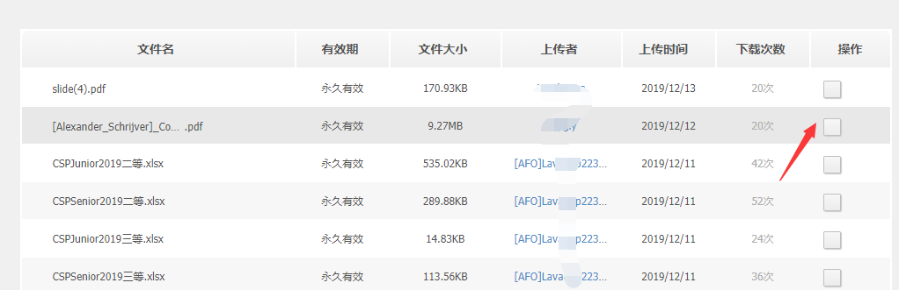

## 引言

众所周知，用QQ客户端下载QQ群文件的速度实在是缓慢，这里讲一下如何利用多线程快速下载腾讯QQ群文件。
<!--more-->
原始事件发生在2018年8月4日，笔者的同学制作了一个毕业短片并且将其上传到了班级的QQ群文件里面 ，群主十分激动。文件体积虽然只有200MB，但是下载速度真的是很慢，令笔者非常难受，于是就有了这篇文章。
**关于多线程如何快速下载**群文件的文章其实我已经写过了，但是在网站数据迁移的过程中*不小心*把备份文件全部删除了。*虽然我有经常备份的习惯*，但还是只恢复了一部分，所以写这篇文章简单复述一下流程

## 思路

1.获取QQ群文件的下载直链
2.使用现有的多线程下载工具进行多线程下载
> 当然，本思路也普遍适用于提升 仅限制单个线程下载速度的下载 的下载速度（经测试下载百度云盘文件用此方法开太多线程会导致404，不过少一些速度也很快）
>
## 实现过程

我们这里仅用Windows 10操作系统，Chrome游览器和洛谷群群文件进行演示

> **注意**我们这里仅用Windows 10操作系统，Chrome游览器和洛谷群群文件进行演示

经过一番搜索，我发现QQ群群文件是有页面版的，我们不妨登入页面：
<http://qun.qzone.qq.com/group>

当然，你也可以使用链接

<http://qun.qzone.qq.com/group#>!/群号/share

比如洛谷用户群 <http://qun.qzone.qq.com/group#!/515055655/share>

如果你打开的是第一个链接，你将会看到

悬浮在标题栏“我的群”上，选择你需要得到群组，我这里选择了 Hello Luogu群作为演示。

进入一个新的页面后，你将会看到这样的div区块，点击第二个按钮“群文件”
如果你已经点击了那个按钮或者你打开是的是第二个链接，你将会看到：

点击白色方块，即“下载”
然后通过下载链接调用你的多线程下载工具。

## 关于多线程下载工具

关于多线程下载工具，我这里推荐

- ADM （即 Advanced Download Manager ）
- IDM（即Internet Download Manager）

详细的使用方法我不在赘述，可以自行翻阅官方文档。

这样，你就学会了如何利用多线程快速下载腾讯QQ群文件。

## 本方法已经失效

原因是腾讯已经关闭了QQ群空间
