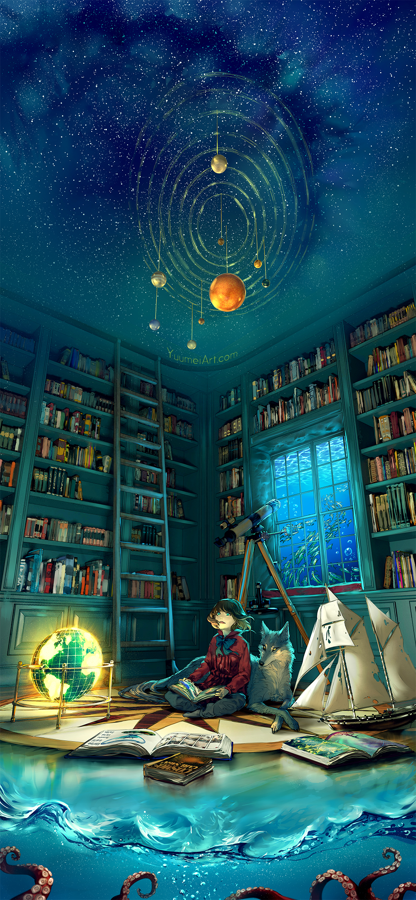

## 正文

现在是凌晨2点30分，我重新坐到书桌前开始写这篇随笔。对我而言，凌晨这段的安静是我不多的能让我“逃离”这个世界的时间。好像是因为初三的暑假看了些游记和博客随笔，自那时起我总喜欢隔些日子写写东西（可惜，多数已经不见了踪影）。那时是近乎疯狂与魔幻的生活的序幕，而现在是2022年10月22日，我彻底脱离过往几年那种的生活已经四个多月了。时至今日，我思想中的大学生活依旧是缺乏实感的；未来的生活依旧是缺乏想象的。面对繁琐的作业与任务，仿佛可及的目标与梦想，这几个月算是稳稳地度过了。

<!--more-->

坐在寂静的宿舍里时，我时常回想起以前自己总喜欢站在窗边向远方眺望的场景--初三傍晚趴在学校自习教室外的栏杆上接受晚风的洗礼，高考备考时一个个难眠的夜晚依在窗台仰望无际的夜空。我似乎是一个难以割舍离的人，总还是会在面拂熟悉的晚风与仰望熟悉的夜空时，在陌生的人潮人涌中时，想起以前的朋友和同学们的说笑。每当想起这些，心中总有种说不出的感觉，也常常会讲：“啊，要是能回到那时候就好了。”记忆这种东西真是奇妙，明明本是当时日复一日的常态，现在看来却像宝石一样闪耀。 

我不止一次地在脑海中问我自己，“你后悔过去的选择吗？”我告诉自己，“有遗憾，但是不后悔。”这句话不知是否发自真心？可能还是有一丝后悔吧，不过我可能已经做了在当时的眼界与能力下能做的一切，也不该有后悔罢。过往的事情已经发生了，无论如何，现在只剩下自己回味啦。
*“我们所可以自慰的，想来想去，也还是所谓对于将来的希望。”* 

我如愿在大学学到了可能是曾经热爱的学科。在经济下行的大环境下，“本硕985找不到工作；微软挂掉所有日常实习生”的新闻每每让人心生焦虑。不过好在不是陷入所谓“不转专业就没出路”的境况，更何况大一也还不至于太过紧张。目前希望能多坐会儿冷板凳，看看自己究竟有没有这方面的科研或开发能力，再来讲这些未来规划也不迟罢。

近些日子不是很太平，又是一轮大潮席卷全国，蜷居在噪杂的寝室里常常有所事但也无所获。虽然在看到苗头的时候已经做了些心理和物质上的准备，可是现状还是引得心里发慌。不幸的是，视目前发展情况，短期内似乎是无法恢复正常了。“COVID夺走了我的青春”，真的不是闹着玩的。

一瞬间，还太多东西要讲，不如先点一个逗号，以后再慢慢讲吧。毕竟这段故事，还在纸上书写呢。

> “无边的海洋里漂流的小船，不知何时就会被狂风所倾覆；而小船上平凡的我们，也只能怀着渺茫的希望，跟随着舵手指引的航向前行吧。——[2019年信息学竞赛十二省联考]希望”

2022年10月22日04时15分写毕

)